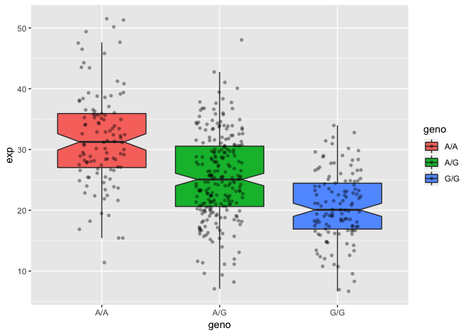

Class 13: Genome Bioinformatics 1
================

What proportion of the Mexican Ancestry in Los Angeles sample population (MXL)
------------------------------------------------------------------------------

are homozygous for the asthma associated SNP (G|G)?

I obtained this input from:<http://uswest.ensembl.org/Homo_sapiens/Variation/Sample?db=core;r=17:39895045-39895146;v=rs8067378;vdb=variation;vf=362656008;sample=mxl#373531_tablePanel>

``` r
mxl <- read.csv("373531-SampleGenotypes-Homo_sapiens_Variation_Sample_rs8067378.csv")

head(mxl)
```

    ##   Sample..Male.Female.Unknown. Genotype..forward.strand. Population.s.
    ## 1                  NA19648 (F)                       A|A ALL, AMR, MXL
    ## 2                  NA19649 (M)                       G|G ALL, AMR, MXL
    ## 3                  NA19651 (F)                       A|A ALL, AMR, MXL
    ## 4                  NA19652 (M)                       G|G ALL, AMR, MXL
    ## 5                  NA19654 (F)                       G|G ALL, AMR, MXL
    ## 6                  NA19655 (M)                       A|G ALL, AMR, MXL
    ##   Father Mother
    ## 1      -      -
    ## 2      -      -
    ## 3      -      -
    ## 4      -      -
    ## 5      -      -
    ## 6      -      -

``` r
table(mxl$Genotype..forward.strand.)
```

    ## 
    ## A|A A|G G|A G|G 
    ##  22  21  12   9

``` r
table(mxl$Genotype..forward.strand.) / nrow(mxl) * 100
```

    ## 
    ##     A|A     A|G     G|A     G|G 
    ## 34.3750 32.8125 18.7500 14.0625

FASTQ Quality scores
--------------------

``` r
#install.packages("seqinr")
#install.packages("gtools")
library(seqinr)
library(gtools)
chars <- s2c("DDDDCDEDCDDDDBBDDDCC@")
chars
```

    ##  [1] "D" "D" "D" "D" "C" "D" "E" "D" "C" "D" "D" "D" "D" "B" "B" "D" "D"
    ## [18] "D" "C" "C" "@"

``` r
phred <- asc( chars ) - 33
phred 
```

    ##  D  D  D  D  C  D  E  D  C  D  D  D  D  B  B  D  D  D  C  C  @ 
    ## 35 35 35 35 34 35 36 35 34 35 35 35 35 33 33 35 35 35 34 34 31

Genotype based expression levels
--------------------------------

``` r
expr <- read.table("rs8067378_ENSG00000172057.6.txt")
```

``` r
table(expr$geno)
```

    ## 
    ## A/A A/G G/G 
    ## 108 233 121

``` r
inds.gg <- expr$geno == "G/G"
summary(expr[inds.gg, "exp"])
```

    ##    Min. 1st Qu.  Median    Mean 3rd Qu.    Max. 
    ##   6.675  16.903  20.074  20.594  24.457  33.956

``` r
inds.ag <- expr$geno == "A/G"
summary(expr[inds.ag, "exp"])
```

    ##    Min. 1st Qu.  Median    Mean 3rd Qu.    Max. 
    ##   7.075  20.626  25.065  25.397  30.552  48.034

``` r
inds.aa <- expr$geno == "A/A"
summary(expr[inds.aa, "exp"])
```

    ##    Min. 1st Qu.  Median    Mean 3rd Qu.    Max. 
    ##   11.40   27.02   31.25   31.82   35.92   51.52

``` r
boxplot(exp ~ geno, data=expr, notch=TRUE)
```


``` r
# Boxplot with the data shown
#install.packages("ggplot2")
library(ggplot2)
ggplot(expr, aes(geno, exp, fill=geno)) + 
  geom_boxplot(notch=TRUE, outlier.shape = NA) + 
  geom_jitter(shape=16, position=position_jitter(0.2), alpha=0.4)
```


