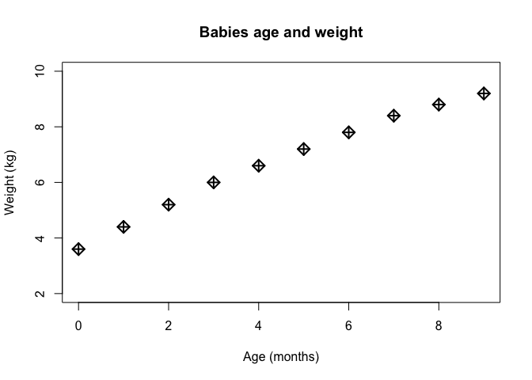
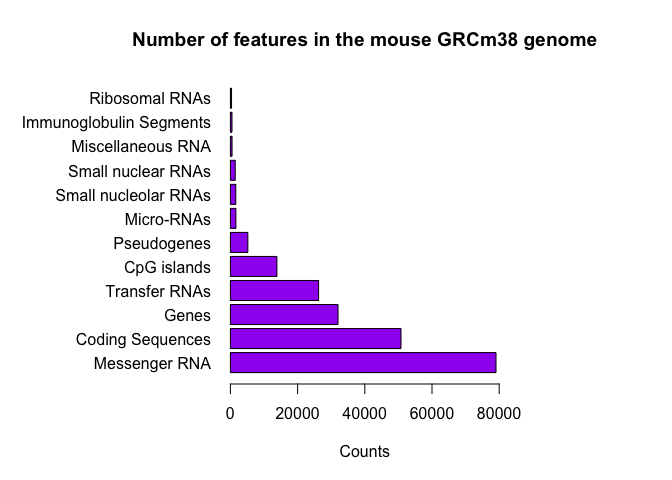
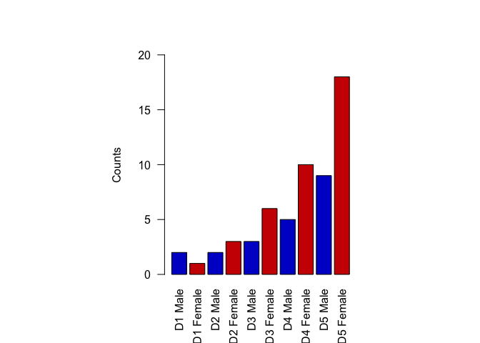
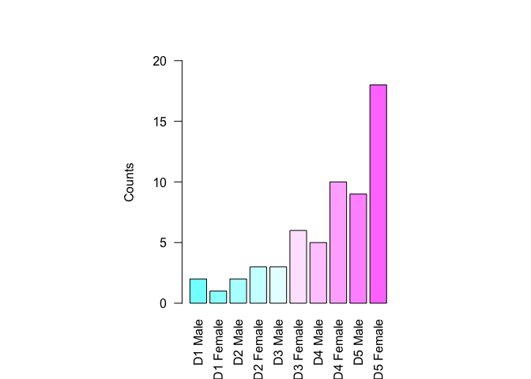
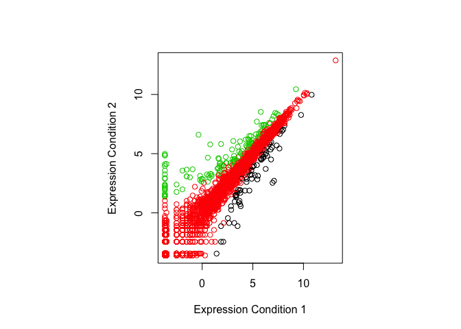
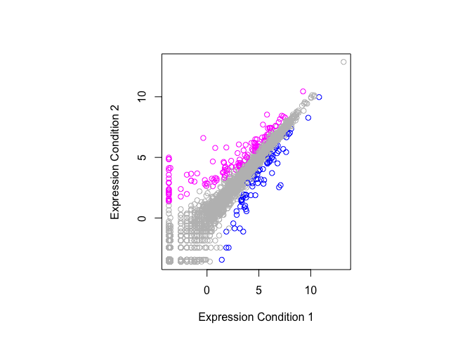

Class 5 R Graphics
================
Lydia Hernandez
January 25, 2019

Class 05 Graphics and plots with R Narrative text that I can style **bold** and *italic* and add links to the [webpages](https://aerialrevolution.com/)

``` r
# Section 2A: line plot

weight <- read.table("bimm143_05_rstats/weight_chart.txt", header = TRUE)

plot(weight, pch = 9, cex = 1.5, lwd = 2, ylim=c(2,10), xlab="Age (months)", ylab="Weight (kg)", main="Babies age and weight")
```



``` r
# Section 2B: bar plot

feat <- read.table("bimm143_05_rstats/feature_counts.txt", header = TRUE, sep="\t")

par(mar=c(5, 12, 4, 9))
barplot(feat$Count, names.arg = feat$Feature, las=1, horiz = TRUE, xlab = "Counts", las=1, 
        col = "purple", main = "Number of features in the mouse GRCm38 genome", xlim = c(0,80000))
```



``` r
# Section 3A: colors in plots

mf <- read.delim("bimm143_05_rstats/male_female_counts.txt", header = TRUE, sep = "\t")

barplot(mf$Count, names.arg = mf$Sample, las = 2, col = c("blue3", "red3"), ylab = "Counts", ylim = c(0,20))
```



``` r
barplot(mf$Count, names.arg = mf$Sample, las = 2, col = cm.colors(nrow(mf)), ylab = "Counts", ylim = c(0,20))
```



``` r
# Section 3B: coloring by value

genes <- read.delim("bimm143_05_rstats/up_down_expression.txt")
table(genes$State)
```

    ## 
    ##       down unchanging         up 
    ##         72       4997        127

``` r
plot(genes$Condition1, genes$Condition2, col = genes$State, 
  xlab = "Expression Condition 1", ylab = "Expression Condition 2")
```



``` r
palette()
```

    ## [1] "black"   "red"     "green3"  "blue"    "cyan"    "magenta" "yellow" 
    ## [8] "gray"

``` r
palette(c("blue", "gray", "magenta"))
plot(genes$Condition1, genes$Condition2, col = genes$State, 
     xlab = "Expression Condition 1", ylab = "Expression Condition 2")
```


